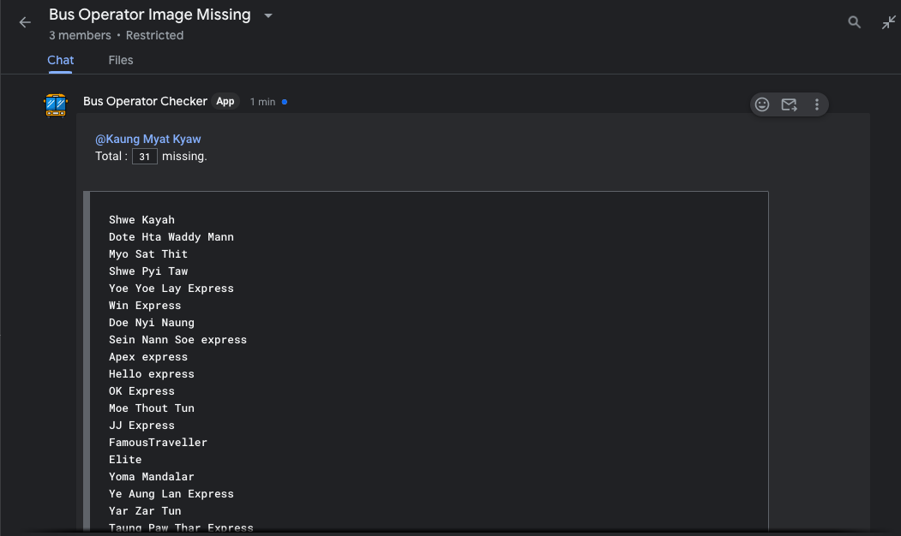

## :oncoming_bus: Flymya Bus Image Checker

Automation script for checking missing bus images for operators in Flymya.

## About

In Flymya, whenever a new bus operator name is added by the finance team, the marketing PO need to find the missing operator image from online and give it to the Front-end developers and the developers add the new operator image to the "assets" folder of the Frontend project. To find the image missing operators, the marketing PO has to check each bus route and see missing bus images. Which is repeatative and has a lot chances of missing out many operators.

This automation script fetches all the operators from the back-end server, pull the git lastes update form frontend project and check operators with the images in "assets" folder and list all the image missing operators name then send the list in the google chat and let the PO know about it. This script runs on every week so, no need to run the scirpt manually to check for the image update.

## Screenshot

